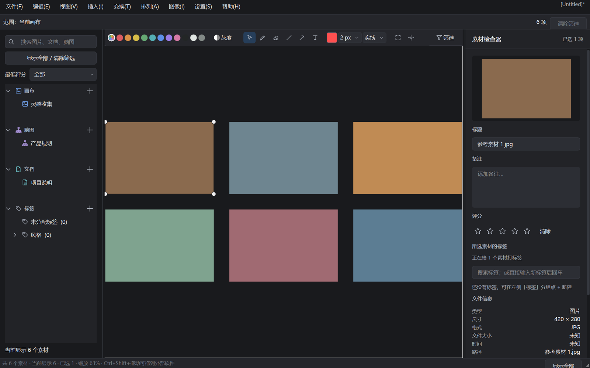
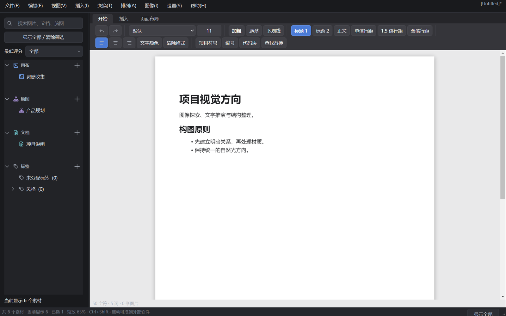
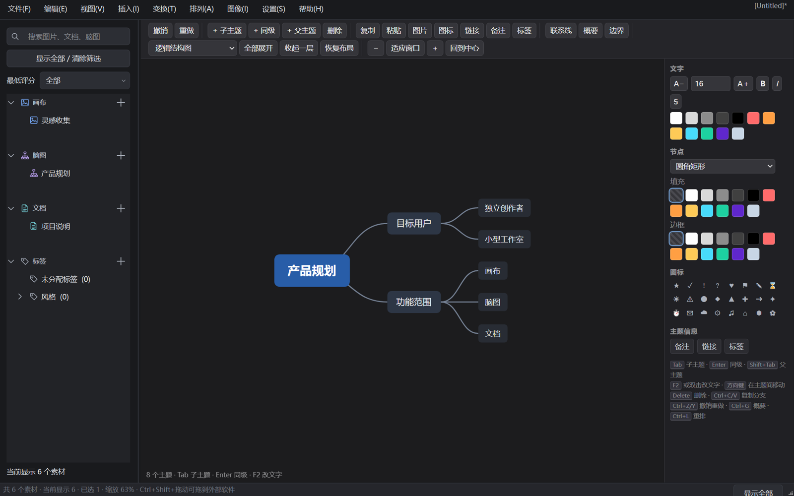
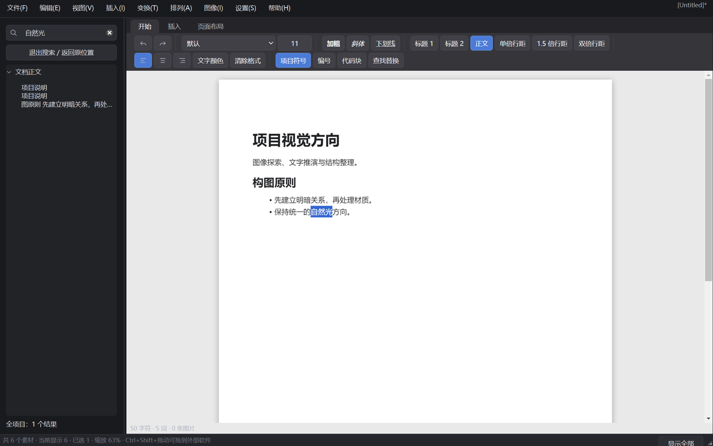
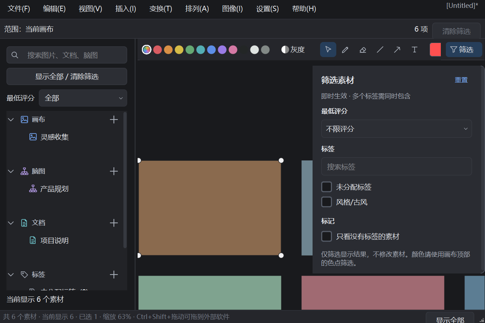

<p align="center"></p>
<h1 align="center">Prism</h1>
<p align="center">把参考素材、图文笔记和思维导图放进同一个本地创作项目。</p>

Prism 是面向插画、设计、建模和内容创作的桌面工作空间。你可以收集参考图片，在自由画布上比较和排列素材，用文档记录想法，再用脑图整理结构。项目保存在本地 `.prism` 文件中。

本项目基于 Rebecca Breu 的上游项目扩展，保留原有版权与 GPL 声明，新增素材管理、多页面文档、脑图和采集等功能。详见 [NOTICE](NOTICE) 和 [第三方许可](THIRD_PARTY.md)。

[简体中文](README.md) · [English](README.en.md)

## 界面预览

以下图片由当前程序实际渲染，使用合成演示素材，不包含用户私人工程或第三方作品。

### 参考画布与素材检查器



在画布中自由排列参考素材；右侧查看标题、备注、评分、标签和文件信息。

### 图文文档



在同一项目中记录创作方向、说明和清单。文档采用纸张布局，提供富文本工具栏。

### 思维导图



通过分支整理产品规划、故事结构与创作思路，支持节点编辑、布局、折叠和样式调整。

### 项目搜索与筛选





## 主要功能

| 模块 | 能做什么 |
| --- | --- |
| 自由画布 | 导入素材，移动、缩放、旋转、翻转、排列、查看实际大小，绘制笔迹、线条和箭头 |
| 资源树 | 组织画布、文档、脑图和文件夹，创建、重命名、移动、排序、删除与恢复 |
| 素材整理 | 标题、备注、标签、1–5 星评分，多选批量编辑，按标签、评分和颜色筛选 |
| 项目搜索 | 搜索页面、文档正文、脑图节点及素材信息，跳转到对应内容 |
| 图文文档 | 标题、文字格式、列表、待办、图片、表格、链接、代码块、查找替换 |
| 思维导图 | 创建同级／子主题，编辑分支、折叠展开、布局、颜色、文字样式和节点信息 |
| 视频抽帧 | 读取视频信息，按参数抽取帧，取消任务，将结果导入画布 |
| 图像预览 | 实际大小、曝光、通道、直方图和色调映射；预览调整不覆盖源文件 |
| 三维模型 | GLB／glTF 缩略图与交互预览，旋转、缩放、重置视角 |
| 采集 | 剪贴板图片收集箱；配套浏览器扩展可发送网页图片 |
| 查重 | 重复／相似图候选检测，查看分组并定位素材；不会自动删除 |
| 导入导出 | 文件夹、图片、DOCX、XMind 等导入；画布图片、原始素材、文档和脑图导出 |
| 本地保存 | `.prism` 项目持久化，未保存提示、自动保存与部分编辑内容恢复机制 |

具体可用格式取决于文件内容及解码器。PSD 使用合成预览，不编辑图层；GLB／glTF 是预览功能，不替代三维编辑软件。

## Windows 安装

1. 打开本仓库的 **Releases** 页面。
2. 下载 `Prism-Setup-0.3.5-windows-x64.exe`。
3. 双击安装，选择安装目录；可选创建桌面快捷方式。
4. 从开始菜单启动 Prism，或双击 `.prism` 项目文件。

安装版包含 Python 和运行时依赖，无需另装 Python。默认按当前用户安装，不要求管理员权限；支持 Windows 设置中的卸载。程序与项目文件使用统一的 Prism 图标。

目前提供 Windows x64 安装包；本轮构建与验证使用 Windows 11、Python 3.12。其他 Windows 版本、Linux 和 macOS 尚未完成同等级别的安装版验收。

安装包目前未代码签名。请从本仓库 Releases 获取，并核对随发布提供的 SHA-256。

## 开始使用

1. 新建或打开项目，在左侧画布分区创建一个画布。
2. 把参考图片拖入画布，排列、缩放和比较。
3. 选中素材，在右侧补标题、备注、标签和评分。
4. 在文档分区创建说明或创作笔记；在脑图分区整理主题。
5. 用左侧搜索查找内容，通过筛选缩小素材范围。
6. 按 `Ctrl+S` 保存为 `.prism`，下次继续编辑。

### 常用操作

| 操作 | 方式 |
| --- | --- |
| 保存项目 | `Ctrl+S` |
| 撤销／重做 | `Ctrl+Z`／`Ctrl+Y`，作用范围依当前编辑器而定 |
| 素材实际大小 | 画布中选中图片后按 `3` |
| 资源重命名 | 选中资源后按 `F2` |
| 脑图子主题／同级 | `Tab`／`Enter` |
| 脑图编辑文字 | `F2` 或双击节点 |
| 无格式粘贴 | 文档中 `Ctrl+Shift+V` |
| 拖到其他软件 | 选中画布素材，按住 `Ctrl+Shift` 拖出 |

完整的画布鼠标和键盘操作可在程序帮助及设置中查看；部分手势可自定义。

## 浏览器图片采集

配套扩展位于 [`browser-extension`](browser-extension)。按其中的 [说明](browser-extension/README.md) 在 Chromium 浏览器中加载扩展，先启动 Prism，再从网页发送图片。

桥接服务仅监听 `127.0.0.1:47653`。网络访问用于下载用户明确选择的图片；登录受限站点、反盗链、blob URL 和 CSS 背景图可能无法采集。扩展目前需要手动加载，没有宣称已发布到 Chrome 商店。

## 数据与隐私

- 项目内容保存在本地，当前不提供云同步或协作服务。
- 图片和文档附件可以嵌入项目；视频及较大模型可能使用外部路径引用。移动项目时请同时检查这些源文件。
- 剪贴板采集可在设置中关闭；默认以图片为主，并过滤已知密码管理器来源。这种过滤不能保证识别所有敏感来源。
- 日志、设置和恢复记录在当前用户的 Prism 配置目录中，可能包含文件名与路径。报告问题时请先删除私人信息。
- 恢复机制主要覆盖文本／页面内容，不应视为整个项目的完整备份。重要工程请保留独立备份。

## 已知边界

- 没有 AI 语义搜图、云同步、智能文件夹和文件夹监听功能。
- 相似图检测使用感知哈希，结果需要人工判断，纯色素材可能误报。
- 文档导入导出不保证与 Word／WPS 的复杂排版完全一致。
- 脑图 SVG／PDF 矢量导出尚未交付；可用导出格式以实际菜单为准。
- 项目存在 Qt／媒体后端退出阶段的历史崩溃记录；部分测试需按文件隔离运行。不要将测试断言通过等同于所有退出路径已修复。
- 本轮已验证安装、启动、卸载及部分回归测试；干净虚拟机、全部媒体格式与系统 DPI 组合仍需进一步验收。

## 从源码运行

建议 Python 3.12。在 Windows PowerShell 中：

```powershell
python -m venv .venv
.\.venv\Scripts\python -m pip install -e ".[media]"
.\.venv\Scripts\python -m prism
```

基础安装使用 `pip install -e .`；`[media]` 增加 OpenImageIO 和 Pillow，支持更多图像格式。系统缺少可用 OpenGL 上下文时，模型预览会尝试软件回退。

### 测试

```powershell
.\.venv\Scripts\python -m pip install -r requirements/test.txt
$env:QT_QPA_PLATFORM = 'offscreen'
.\.venv\Scripts\python tools/run_tests_safe.py
```

测试工具按文件启动独立进程，记录超时、断言失败和退出异常。请查看报告中的异常标记，不要只看通过数量。

### 构建安装程序

```powershell
.\.venv\Scripts\python -m pip install -r requirements/build.txt
.\.venv\Scripts\python tools/collect_licenses.py
.\.venv\Scripts\python -m PyInstaller --noconfirm --clean Prism.spec
# 安装 Inno Setup 6 后：
iscc packaging/Prism.iss
```

程序本体输出到 `dist/Prism`；供用户下载的安装程序输出到 `release`。源码、构建脚本和第三方许可应与同版本安装程序一起发布，见 [发布指南](packaging/README.md)。

## 项目结构

```text
prism/                 应用代码与随包资源
browser-extension/     配套浏览器图片采集扩展
tests/                 自动化测试
tools/                 可重复使用的开发与构建工具
packaging/             安装脚本、依赖许可及发布配置
docs/images/           当前程序演示截图
.github/workflows/     自动化检查与发布流程
```

构建缓存、开发虚拟环境、测试原始日志、私人数据和安装包不进入源码仓库；安装包通过 Releases 分发。

## 许可证与致谢

项目采用 **GPL-3.0-or-later**。原有上游代码的版权、作者信息及许可声明保持保留；重新分发修改版与安装包时，需遵守对应源码和许可要求。

- 原项目与作者：Rebecca Breu；详见 [NOTICE](NOTICE)。
- 桌面框架：PyQt6 / Qt。
- 文档编辑内核：Quill，BSD-3-Clause。
- 脑图编辑内核：simple-mind-map，MIT。
- 视频解码：PyAV 与其随包 FFmpeg 构建。

完整许可见 [LICENSE](LICENSE)、[THIRD_PARTY.md](THIRD_PARTY.md) 及 `packaging/licenses`。Prism Logo 为本项目生成的设计稿；其 SVG 是嵌入 PNG 的包装，并非手工矢量源稿。

欢迎通过本仓库 Issues 提交问题。请附程序版本、系统版本、复现步骤和经过脱敏的截图；不要上传私人项目或敏感日志。
